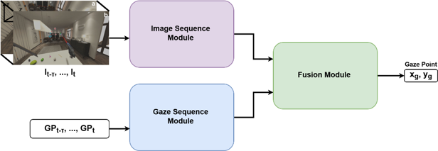
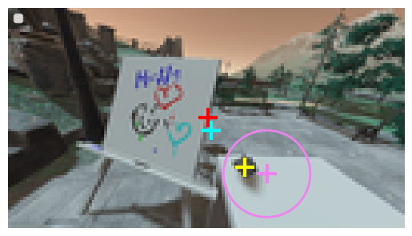
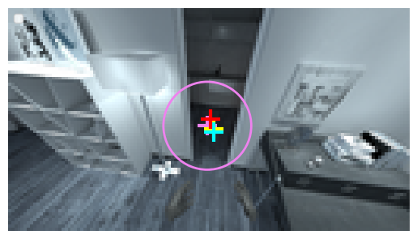
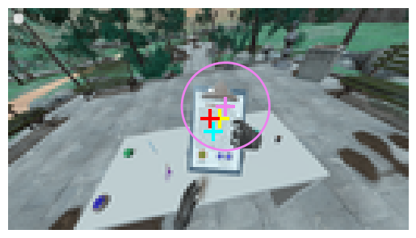
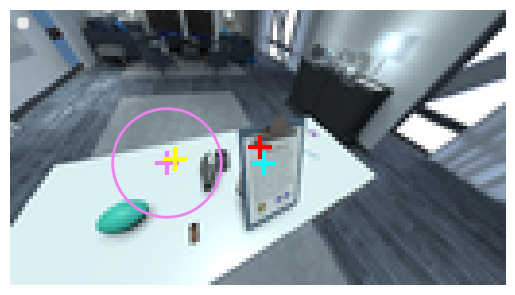
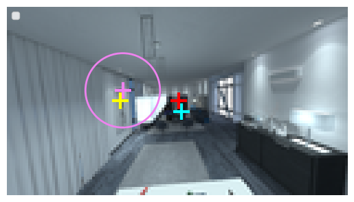
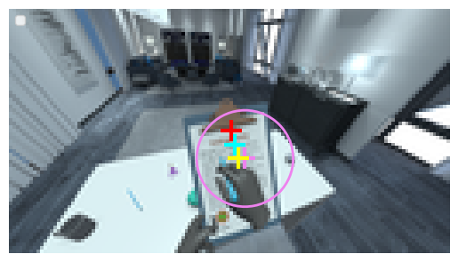
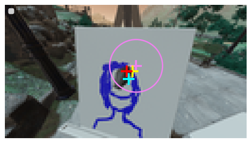
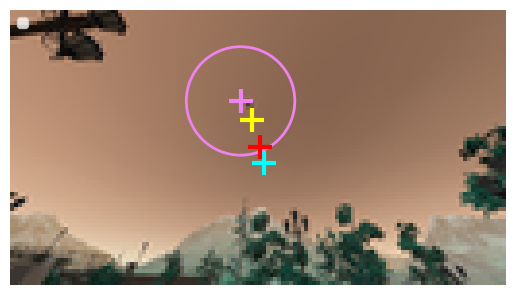

# A Gaze Prediction Model for Task-Oriented Virtual Reality

This repository contains the code developed for my diploma thesis.

 **Publication**  
 "A Gaze Prediction Model for Task-Oriented Virtual Reality", *Eurographics Annual Conference 2025 Posters*
 
**Authors:** Konstantina Mammou, Katerina Mania  
**DOI:** https://doi.org/10.2312/egp.20251020

---

## Project Overview
In this work, we present a gaze prediction model for Virtual Reality task-oriented environments. Unlike past work which focuses on gaze prediction for specific tasks, we investigate the role and potential of **temporal continuity** in enabling accurate predictions in **diverse task categories**. The model reduces input complexity while maintaining high prediction accuracy. Evaluated on the [OpenNEEDS dataset](https://dl.acm.org/doi/abs/10.1145/3448018.3457996), it significantly outperforms baseline methods. The model demonstrates strong potential for integration into gaze-based VR interactions and foveated rendering pipelines. Future work will focus on runtime optimization and expanding evaluation across diverse VR scenarios.

**Model Architecture**<br>


- [preprocess_dataset.py](https://github.com/k-mammou/A-Gaze-Prediction-Model-for-Task-Oriented-Virtual-Reality/blob/main/preprocess_dataset.py): Load and preprocess the dataset (normalisation, outlier removal, 3D gaze vectors to 2D gaze angles etc). 
- [FullModel.ipynb](https://github.com/k-mammou/A-Gaze-Prediction-Model-for-Task-Oriented-Virtual-Reality/blob/main/FullModel.ipynb): Model architecture and training.
- [FinalEvaluation2.ipynb](https://github.com/k-mammou/A-Gaze-Prediction-Model-for-Task-Oriented-Virtual-Reality/blob/main/FinalEvaluation2.ipynb): Calculate angular error, recall rate, CDF, compare with baselines.
- [Visualisation.ipynb](https://github.com/k-mammou/A-Gaze-Prediction-Model-for-Task-Oriented-Virtual-Reality/blob/main/Visualisation.ipynb): Plot predictions on frames.

**Visualised Results**<br>
<p align="left">
  
  
</p>
<p align="left">
  
  
</p>
<p align="left">
  
  
</p>
<p align="left">
  
  
</p>

The **purple** cross denotes the **ground truth** gaze position, with the purple circle illustrating the foveal region with radius 15°. The **yellow** cross represents the **prediction** of our model, the **red** cross shows the **center baseline** and the **blue** the **mean baseline**.


---
## Citation
If you find this repo useful to your project, please consider citing the following paper: 
```
@inproceedings{10.2312:egp.20251020,
booktitle = {Eurographics 2025 - Posters},
editor = {Günther, Tobias and Montazeri, Zahra},
title = {{A Gaze Prediction Model for Task-Oriented Virtual Reality}},
author = {Mammou, Konstantina and Mania, Katerina},
year = {2025},
publisher = {The Eurographics Association},
ISSN = {1017-4656},
ISBN = {978-3-03868-269-1},
DOI = {10.2312/egp.20251020}
} 
```
## Contact
For any questions, feel free to contact
kninamm@gmail.com
